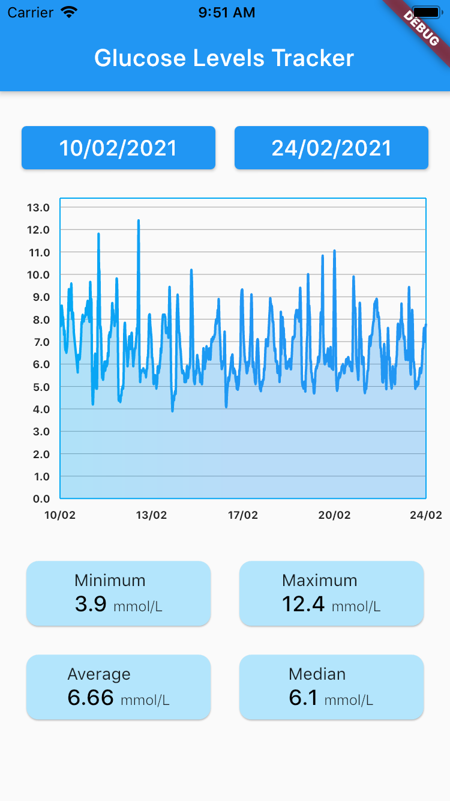

# glucose_levels_tracker

Single page flutter application to display glucose levels tracker.




## Prerequisites
Visit [here](https://flutter.dev/docs/get-started/install) on how to set up your computer for Flutter.
- Install Flutter (version 2.2.2)
- Install Xcode (to run project on iOS simulator)
- Install Android Studio (to run on your Android device or Android Emulator)


## How to Run

**Step 1:**
Download or clone this repo by using the link below:
```
https://github.com/naz-eze/glucose_levels_tracker.git
```

**Step 2:**
Go to project root and execute the following command in console to get the required dependencies: 
```
flutter pub get 
```

**Step 3:**
This project uses `mockito` library that works with code generation, execute the following command to generate mock test file if you run into issues building the project:
```
flutter pub run build_runner build --delete-conflicting-outputs
```

**Step 4:**
Ensure you have one device running. It could be an iOS Simulator, Android Emulator, or Android phone.
```
flutter devices
```

**Step 5:**
Run the project

- For iOS, change directory to `ios` and run `flutter run`
- For Android, change directory to `android` and run `flutter run`


### Project Structure

Here is the folder structure used in this project.
```
lib/
|- constants/
|- exceptions/
|- extensions/
|- models/
|- notifiers/
|- services/
|- widgets/ 
|- main.dart